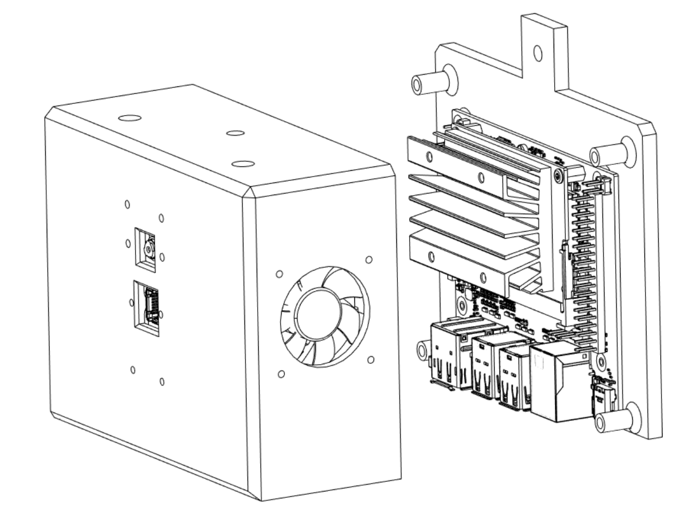

# AI Thermometer for Elevated Temperature Screening

## Version 0.4: Retinaface Facial Detection

### Healthy subject

### (Artificially) elevated temperature:


## Version 0.3: SSD with ResNet-10 Facial Detection + FLIR Lepton 3.5 temp. measurement (~17 FPS w/ GPU accel.)

...

## Version 0.2: Haar Cascade + FLIR Lepton 3.5 temp. measurement (~10FPS, CPU only)
Watch full video: [https://www.youtube.com/watch?v=j9eo9Cs8J8I](https://www.youtube.com/watch?v=j9eo9Cs8J8I)


## Version 0.1: SSD (COCO) + FLIR Lepton 3.5 temp. measurement (~12FPS w/ GPU accel.)
Watch full video: [https://www.youtube.com/watch?v=i2XMtshdjn8](https://www.youtube.com/watch?v=i2XMtshdjn8)


## Hardware 


## Quickstart 

1. Flash Nvidia Jetson Nano with the latest Nvidia JetPack. Update package manager

```shell
sudo apt update && sudo apt upgrade
```

2. Build OpenCV >4.4. It is required for CUDA DNN support.
```shell
wget https://raw.githubusercontent.com/mdegans/nano_build_opencv/master/build_opencv.sh
chmod +x build_opencv.sh
./build_opencv.sh
```
3. Build pytorch (instructions [here](https://forums.developer.nvidia.com/t/pytorch-for-jetson-version-1-7-0-now-available/72048))

4. Download AI Thermometer

```shell
git clone https://github.com/tomek-l/ai-thermometer
cd ai-thermometer
```

5. Run AI Thermometer

```shell
python3 main.py
```

6. Optionally, 3D print & assemble the enclosure from [here](https://a360.co/3g8kfqV)

## Limitations

### IR and RGB camera alignment.

The current way of calculating the correspondence between IR and RGB cameras is not ideal.
Factors, such as the non-rigid mount of the sensor on the Raspberry Pi CMV2.1 don't help.
I'm actively working on calibration code that takes into account the intrinsic parameters of both cameras, which should allow for obtaining a pixel-level correspondence between the imags.

## FAQ/common issues:

### 1. uvc_open error -3

Reason: Your current user does not have r/w access to the PureThermal USB device. 

For a quick and dirty fix you can do do:
```shell
echo 'SUBSYSTEM=="usb",  ENV{DEVTYPE}=="usb_device", GROUP="plugdev", MODE="0664"' | sudo tee /etc/udev/rules.d/10-libuvc.rules 
sudo udevadm trigger
```
(this gives camera access to all users)

For a better, fine-grained permission setup, create a new group, give permissions to that group only and your user to the newly created group. You can read more [here](http://wiki.ros.org/libuvc_camera#Permissions).

### 2. Illegal instruction (core dumped)

Reason: The provided  ```libuvc.so``` is compiled for AArch64.
It is a custom version of libuvc that supports Y16 video format. If you're using different architecture, you will need to build the library from source:

```shell
git clone https://github.com/groupgets/libuvc
cd libuvc
mkdir build
cd build
cmake ..
make
cp libuvc.so ~/ai-thermometer/ir/libuvc_wrapper
```

### 3. Using sudo

You don't need ```sudo``` to run any code in this repository 🙂

## ACM SenSys 2020 Demo
ACM SenSys 2020 demo paper: https://dl.acm.org/doi/10.1145/3384419.3430433 and Video demo: [https://youtu.be/3wAjgFXskrE](https://youtu.be/3wAjgFXskrE)
### If find this useful for academic purposes, please cite our work: 
Tomasz Lewicki and Kaikai Liu. 2020. AI thermometer for temperature screening: demo abstract. In Proceedings of the 18th Conference on Embedded Networked Sensor Systems (SenSys '20). Association for Computing Machinery, New York, NY, USA, 597–598. DOI:https://doi.org/10.1145/3384419.3430433
#### Bibtex: 
@inproceedings{10.1145/3384419.3430433,
author = {Lewicki, Tomasz and Liu, Kaikai},
title = {AI Thermometer for Temperature Screening: Demo Abstract},
year = {2020},
isbn = {9781450375900},
publisher = {Association for Computing Machinery},
address = {New York, NY, USA},
url = {https://doi.org/10.1145/3384419.3430433},
doi = {10.1145/3384419.3430433},
booktitle = {Proceedings of the 18th Conference on Embedded Networked Sensor Systems},
pages = {597–598},
numpages = {2},
location = {Virtual Event, Japan},
series = {SenSys '20}
}
